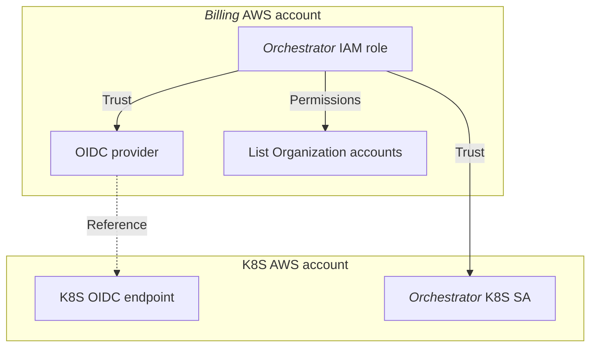
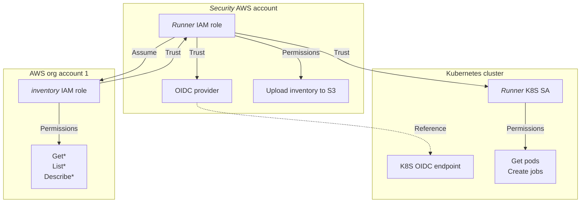
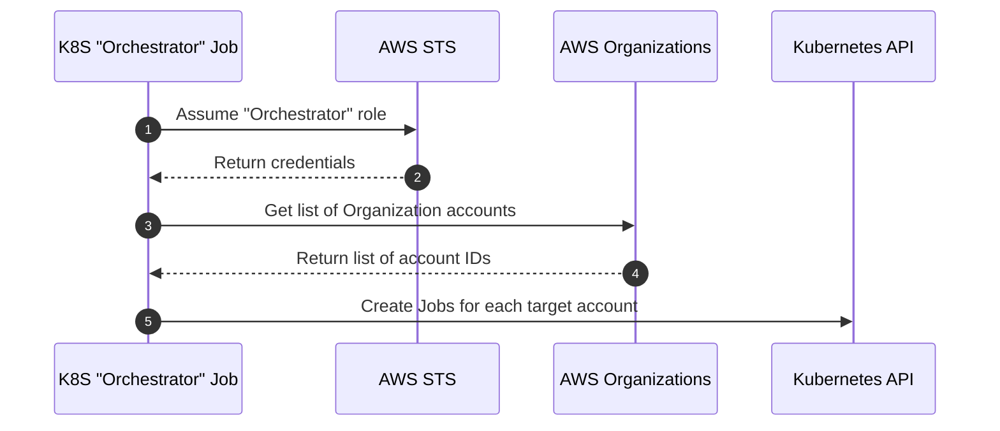
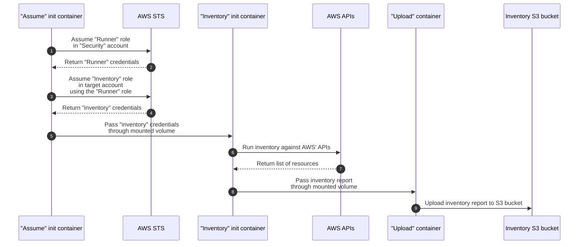

# :warning: Repository not maintained :warning:

Please note that this repository is currently archived, and is no longer being maintained.

- It may contain code, or reference dependencies, with known vulnerabilities
- It may contain out-dated advice, how-to's or other forms of documentation

The contents might still serve as a source of inspiration, but please review any contents before reusing elsewhere.
## Table of contents<!-- omit in toc -->


# AWS Inventory Orchestrator<!-- omit in toc -->

- [Architecture](#architecture)
  - [Overview](#overview)
  - [IAM roles](#iam-roles)
    - [Inventory-Orchestrator trust relationships](#inventory-orchestrator-trust-relationships)
    - [Inventory-Runner trust relationship](#inventory-runner-trust-relationship)
  - [Sequence diagrams](#sequence-diagrams)
    - [Orchestrator sequence](#orchestrator-sequence)
    - [Runner sequence](#runner-sequence)
- [Pipeline](#pipeline)
  - [Deployment prerequisites](#deployment-prerequisites)
  - [Pipeline variables](#pipeline-variables)
- [Development](#development)
  - [Development variables](#development-variables)
  - [Prerequisites](#prerequisites)
  - [Development process](#development-process)

## Architecture

### Overview

Inventories are scheduled through an *Orchestrator* Kubernetes *CronJob*. When a Kubernetes CronJob runs, either according to its schedule or when trigged manually, it spawns an *Orchestrator* Kubernetes *Job*. As soon as they are created, Kubernetes Jobs spawns a Pod, which is removed once it has completed.

Each inventory run is carried out by two different pods: An *Orchestrator* and a *Runner*.

The *Orchestrator* pod is responsible for getting a list of account IDs from the AWS *Organization*, and spawning individual *Runner* jobs for each account to perform inventory against.

The *Runner* pod consists of three containers:

- `assume`: Using a *Runner* IAM role, the container assumes the "inventory" IAM role in the target account, and stores the credentials in a volume shared with the `inventory` container.
- `inventory`: Currently executes [AWS Recon](https://github.com/darkbitio/aws-recon) using the "inventory" IAM role credentials from the `assume` container. Stores the generated inventory report in a volume shared with the `upload` container.
- `upload`: Uploads the generated inventory file to an S3 bucket in the following path: `s3://${BUCKET_NAME}/AWSRecon/${YEAR}/${MONTH}/${DAY}/recon_${ACCOUNT_ID}.json`

### IAM roles

The AWS inventory orchestration involves five different IAM roles:

| Role name                     | Account                           | Can be assumed by                                                  | Permission summary                           |
| ----------------------------- | --------------------------------- | ------------------------------------------------------------------ | -------------------------------------------- |
| `Inventory-Orchestrator`      | *Billing* (aka. Master)           | *Orchestrator* k8s service account<br>in *Prod* using OIDC         | Get all account ID's from AWS Organization   |
| `Inventory-Orchestrator-Test` | *Billing* (aka. Master)           | *Orchestrator* k8s service accounts<br>in test clusters using OIDC | Get all account ID's from AWS Organization   |
| `Inventory-Runner`            | *Security*                        | *Runner* k8s service account in *Prod*                             | Upload inventory report to central S3 bucket |
| `Inventory-Runner-Test`       | *Security*                        | *Runner* k8s service account in test clusters                      | Upload inventory report to central S3 bucket |
| `inventory`                   | All accounts where inventory runs | `Inventory-Runner` and<br>`Inventory-Runner-Test` IAM role         | `Get*`/`List*`/`Describe*` "everything"      |

We currently assume that the [`ce-cli`][ce-cli] tool is used to deploy the `inventory` IAM role into all AWS accounts in the AWS Organization. The `infrastructure` tool will upload the required files to the S3 bucket used by the `ce-cli` tool to their proper location.

The following files under `/infrastructure/policies/` are used to configure the `inventory` IAM role:

| File                        | Description                                                                          |
| --------------------------- | ------------------------------------------------------------------------------------ |
| `inventory_policy.json`     | The inline permission policy document to attach                                      |
| `inventory_properties.json` | Various properties for the role, including any managed permission policies to attach |
| `inventory_trust.json`      | The role trust policy document                                                       |

#### Inventory-Orchestrator trust relationships



The only difference between the `Inventory-Orchestrator` and `Inventory-Orchestrator-Test` role, is the trusted OIDC providers. The non-`Test` role trust OIDC providers referencing OIDC endpoints of production Kubernetes clusters, whereas the `-Test` role trust OIDC providers for any test/sandbox clusters.

#### Inventory-Runner trust relationship



The only difference between the `Inventory-Runner` and `Inventory-Runner-Test` role, is the trusted OIDC providers. The non-`Test` role trust OIDC providers referencing OIDC endpoints of production Kubernetes clusters, whereas the `-Test` role trust OIDC providers for any test/sandbox clusters.

### Sequence diagrams

#### Orchestrator sequence

The "Orchestrator" Kubernetes *CronJob* spawns a new Kubernetes *Job* according to the defined schedule, or when triggered manually.



#### Runner sequence



## Pipeline

### Deployment prerequisites

Most of the required IAM roles and S3 buckets are provisioned with the `infrastructure` tool.

Maybe this should have been Terraform'ed, but we didn't want to deal with state. Considering how the `infrastructure` tool has evolved, maybe we should have.

There's currently a hard dependency on the [`ce-cli`][ce-cli], which is used to deploy the `inventory` IAM role across all AWS accounts in the Organization.

Be sure to set the variables for the `infrastructure` tool before running.

Example usage:

**Bash**

```bash
# Variables
BILLING_ACCOUNT_ID=""
BILLING_ACCOUNT_ROLE_NAME=""
SECURITY_ACCOUNT_ID=""
SECURITY_ACCOUNT_ROLE_NAME=""
CLI_BUCKET_NAME=""
INVENTORY_BUCKET_NAME=""
OIDC_PROVIDER_PROD=""

# Defaults
BILLING_AWS_PROFILE="billing-admin"
SECURITY_AWS_PROFILE="security-admin"
INVENTORY_ROLE="inventory"
ORCHESTRATOR_ROLE_DEPLOY="Inventory-Orchestrator"
RUNNER_ROLE_DEPLOY="Inventory-Runner"

# Login with SAML to the Billing and Security account
go-aws-sso assume -p ${BILLING_AWS_PROFILE} --account-id ${BILLING_ACCOUNT_ID} --role-name ${BILLING_ACCOUNT_ROLE_NAME}
go-aws-sso assume -p ${SECURITY_AWS_PROFILE} --account-id ${SECURITY_ACCOUNT_ID} --role-name ${SECURITY_ACCOUNT_ROLE_NAME}

# Provision infrastructure
./infrastructure --billing-aws-profile "${BILLING_AWS_PROFILE}" --security-aws-profile "${SECURITY_AWS_PROFILE}" --cli-bucket-name "${CLI_BUCKET_NAME}" --inventory-bucket-name "${INVENTORY_BUCKET_NAME}" --inventory-role "${INVENTORY_ROLE}" --orchestrator-role "${ORCHESTRATOR_ROLE_DEPLOY}" --runner-role "${RUNNER_ROLE_DEPLOY}" --oidc-provider-prod "${OIDC_PROVIDER_PROD}"
```

**PowerShell**

```powershell
# Variables
$BILLING_ACCOUNT_ID=""
$BILLING_ACCOUNT_ROLE_NAME=""
$SECURITY_ACCOUNT_ID=""
$SECURITY_ACCOUNT_ROLE_NAME=""
$CLI_BUCKET_NAME=""
$INVENTORY_BUCKET_NAME=""
$OIDC_PROVIDER_PROD=""

# Defaults
$BILLING_AWS_PROFILE="billing-admin"
$SECURITY_AWS_PROFILE="security-admin"
$INVENTORY_ROLE="inventory"
$ORCHESTRATOR_ROLE_DEPLOY="Inventory-Orchestrator"
$RUNNER_ROLE_DEPLOY="Inventory-Runner"

# Login with SAML to the Billing and Security account
go-aws-sso assume -p ${BILLING_AWS_PROFILE} --account-id ${BILLING_ACCOUNT_ID} --role-name ${BILLING_ACCOUNT_ROLE_NAME}
go-aws-sso assume -p ${SECURITY_AWS_PROFILE} --account-id ${SECURITY_ACCOUNT_ID} --role-name ${SECURITY_ACCOUNT_ROLE_NAME}

# Provision infrastructure
./infrastructure --billing-aws-profile "${BILLING_AWS_PROFILE}" --security-aws-profile "${SECURITY_AWS_PROFILE}" --cli-bucket-name "${CLI_BUCKET_NAME}" --inventory-bucket-name "${INVENTORY_BUCKET_NAME}" --inventory-role "${INVENTORY_ROLE}" --orchestrator-role "${ORCHESTRATOR_ROLE_DEPLOY}" --runner-role "${RUNNER_ROLE_DEPLOY}" --oidc-provider-prod "${OIDC_PROVIDER_PROD}"
```

Once infrastructure has been provisioned, deploy the `inventory` IAM role using the `ce-cli` tool, to all accounts to be inventoried.

Re-run the `infrastructure` tool at any time, if any of the policies, or any of the supplied input arguments, have changed.

### Pipeline variables

| Variable name       | Value/description                                                                                                            |
| ------------------- | ---------------------------------------------------------------------------------------------------------------------------- |
| BILLING_ACCOUNT_ID  | Account ID of the *Billing* AWS account (home of the AWS *Organization*)                                                     |
| SECURITY_ACCOUNT_ID | Account ID of the *Security* AWS account                                                                                     |
| ORCHESTRATOR_ROLE   | `Inventory-Orchestrator`                                                                                                     |
| RUNNER_ROLE         | `Inventory-Runner`                                                                                                           |
| BUCKET_NAME         | Name of bucket to store inventory reports (in the *Security* account)                                                        |
| CRON_SCHEDULE       | `0 0 * * 0` (midnight every Sunday)                                                                                          |
| INCLUDE_ACCOUNTS    | Comma-separated list of account IDs (without spaces) to target.<br>If left out, all accounts in *Organization* are targeted. |

## Development

### Development variables

All variables are supplied via the `./k8s/vars.env` file in a simple `VARIABLE=value` format. You can either create the file by hand, defining the variable below.

Alternatively, to mimick the pipeline's logic, you can set the environment variables and run `./generate-vars-file.sh` or `./generate-vars-file.ps1`.

| Variable name       | Value/description                                                                                                                     |
| ------------------- | ------------------------------------------------------------------------------------------------------------------------------------- |
| BILLING_ACCOUNT_ID  | Account ID of the *Billing* AWS account (same as for [pipeline](#pipeline-variables))                                                 |
| SECURITY_ACCOUNT_ID | Account ID of the *Security* AWS account (same as for [pipeline](#pipeline-variables))                                                |
| ORCHESTRATOR_ROLE   | `Inventory-Orchestrator-Test`                                                                                                         |
| RUNNER_ROLE         | `Inventory-Runner-Test`                                                                                                               |
| BUCKET_NAME         | Name of bucket to store inventory reports (same as for [pipeline](#pipeline-variables))                                               |
| CRON_SCHEDULE       | `0 0 * * 0` (same as for [pipeline](#pipeline-variables)                                                                              |
| INCLUDE_ACCOUNTS    | Comma-separated list of account IDs (without spaces) to target.<br>Suggest to include own, and possible other, sandbox accounts only. |

### Prerequisites

- [Skaffold](https://skaffold.dev/)
- EKS sandbox cluster (we currently rely in IRSA for authentication, so no other Kubernetes cluster can be used)
- An OIDC provider deployed in both *Billing* and *Security* account, referencing the OIDC endpoint of sandbox cluster (use [`ce-cli`][ce-cli])
- `./k8s/vars.env` file as described under [Development varaibles](#development-variables)
- Logged in to Docker (Hub) with permission to push to the `dfdsdk/aws-inventory-orchestrator` repo

Example of using the `ce-cli` tool to provision OIDC providers in the *Billing* and *Security* account (substitute `${BILLING_ACCOUNT_ID}`, `${SECURITY_ACCOUNT_ID}`, `${OIDC_PROVIDER_ENDPOINT}` and `${CLUSTER_NAME}` as required):

```bash
ce aws --include-account-ids "${BILLING_ACCOUNT_ID},${SECURITY_ACCOUNT_ID}" create-oidc-provider --url "${OIDC_PROVIDER_ENDPOINT}" --cluster-name "`${CLUSTER_NAME}`"
```

### Development process

- Set Kubernetes context to sandbox cluster
  - Login using `go-aws-sso` if needed
  - Verify with `kubectl get nodes`
- Run `skaffold dev`

Skaffold will monitor Kubernetes manifests and Golang code, build and push changes to Kubernetes and tail the `stdout` output of the CronJob.

The suggested schedule means the inventory will only run once a week. It can be triggered manually as needed, either through [`k9s`](https://k9scli.io/) or the following command:

```bash
kubectl -n inventory create job aws-inventory-orchestrator-manual --from=cronjob/aws-inventory-orchestrator
```

To check status and output, either use `k9s` or these commands:

```bash
# Watch the pods as they spawn or change status
kubectl -n inventory get pods -l app=inventory -w

# Get logs from "runner" pods (including init containers)
kubectl -n inventory logs -l app=inventory -l component=runner --all-containers
```

---
[ce-cli]: <https://github.com/dfds/ce-cli>
