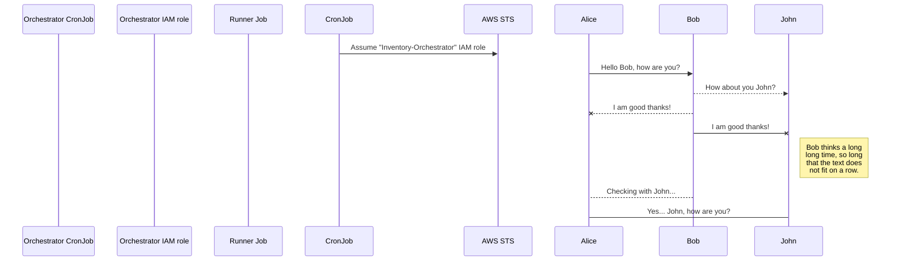
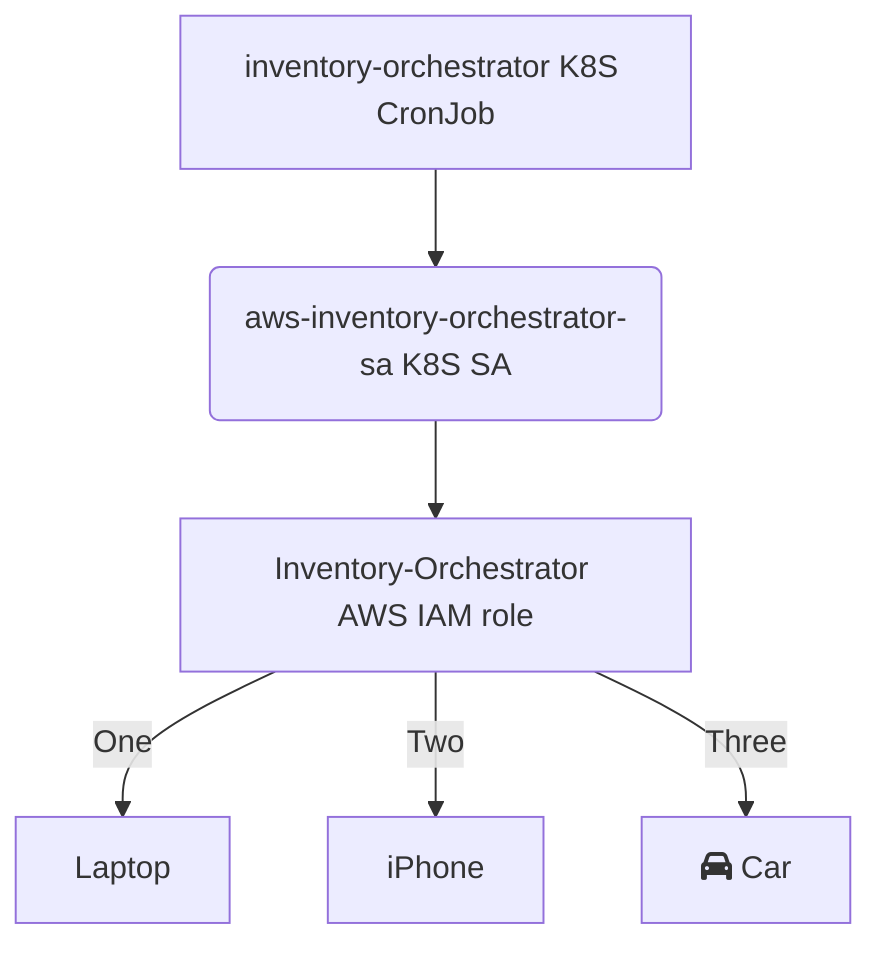

# inventory-orchestrator

## To do

- Create additional IAM role in billing account, with list-accounts rights to Organizations
- Allow role to be assumed by aws-inventory-orchestrator k8s service account
- Orchestrator program:
  - Read list of org accounts (filter by INCLUDE_ACCOUNTS)
  - Spawn separate Kubernetes jobs, passing inventory role ARN (in each account) to assume
- Runner program:
  - Using the inventory-orchestrator AWS IAM role, assume the inventory role in the specified role ARN
  - Run something
- Terraform:
  - Inventory-Orchestrator IAM role (in billing/master)
  - Inventory-Runner IAM role (in dfds-security)
  - OIDC provider in billing/master

### Inventory-Orchestrator and Runner trust relationship

```json
{
    "Version": "2012-10-17",
    "Statement": [
        {
            "Effect": "Allow",
            "Principal": {
                "Federated": "arn:aws:iam::$ACCOUNT_ID:oidc-provider/$OIDC"
            },
            "Action": "sts:AssumeRoleWithWebIdentity",
            "Condition": {
                "StringEquals": {
                    "$OIDC:sub": "system:serviceaccount:inventory:$K8S_SA"
                }
            }
        }
    ]
}
```

Replace $OIDC, $ACCOUNT_ID, $K8S_SA (billing and security respectively).

### Inventory-Runner and Runner policies

```json
{
    "Version": "2012-10-17",
    "Statement": [
        {
            "Sid": "VisualEditor0",
            "Effect": "Allow",
            "Action": "sts:AssumeRole",
            "Resource": "arn:aws:iam::*:role/inventory"
        }
    ]
}
```

## Sequence

Diagrams needed:

- Role/trust hierarchy [TD]
- CronJob job spawning and role assumption [sequence]






## Development

*Work in progress.*

Create `./k8s/vars.env`:

```env
ORCHESTRATOR_ROLE_ARN=arn:aws:iam::$BILLING_ACCOUNT_ID:role/Inventory-Orchestrator
RUNNER_ROLE_ARN=arn:aws:iam::$SECURITY_ACCOUNT_ID:role/Inventory-Runner
CRON_SCHEDULE=* * * * *
```

Suggested prod `CRON_SCHEDULE`: `* * * * 0`

Run `skaffold dev`.
