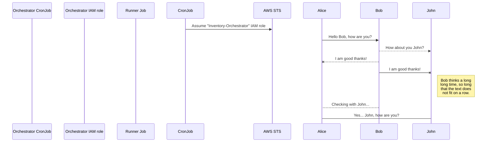
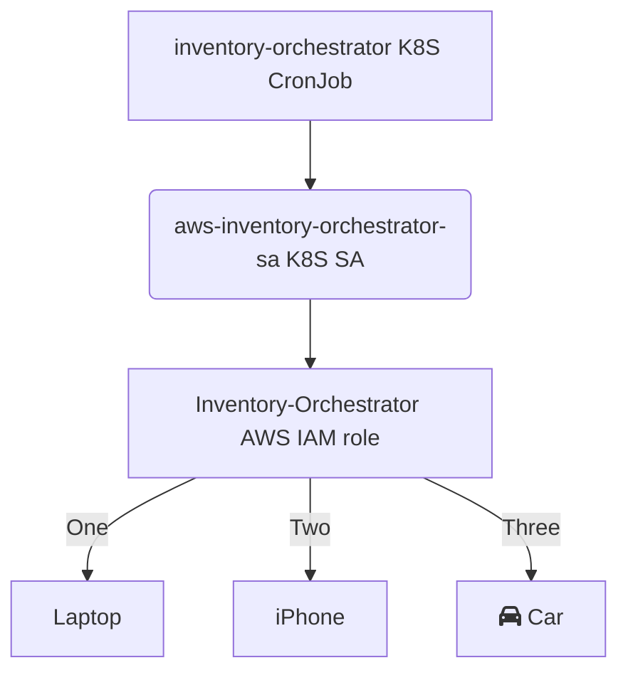

# inventory-orchestrator

## Deployment pre-requisites WIP

```bash
saml2aws login --role arn:aws:iam::${BILLING_ACCOUNT_ID}:role/ADFS-Admin --profile billing-admin --skip-prompt
saml2aws login --role arn:aws:iam::${RUNNER_ACCOUNT_ID}:role/CloudAdmin --profile inventory-runner-admin --skip-prompt
```

```powershell
saml2aws login --role arn:aws:iam::${env:BILLING_ACCOUNT_ID}:role/ADFS-Admin --profile billing-admin --skip-prompt
saml2aws login --role arn:aws:iam::${env:RUNNER_ACCOUNT_ID}:role/CloudAdmin --profile inventory-runner-admin --skip-prompt
```

## To do

- Golang prereqs/infrastructure:
  - Encrypt S3 bucket (in dfds-security)
- Kubernetes:
  - Add common and different labels to orchestrator and runner jobs
- Pipeline stuff
- Containers:
  - Run as non-root
    - Can specify in Dockerfile?
    - CronJob and Job
- Documentation diagrams
- Replace "upload" container with Go program
  - Gunzip before uploading? (~2+ MB x # accounts?)
- Test with multiple accounts

### Inventory-Orchestrator and Runner trust relationship

```json
{
    "Version": "2012-10-17",
    "Statement": [
        {
            "Effect": "Allow",
            "Principal": {
                "Federated": "arn:aws:iam::$ACCOUNT_ID:oidc-provider/$OIDC"
            },
            "Action": "sts:AssumeRoleWithWebIdentity",
            "Condition": {
                "StringEquals": {
                    "$OIDC:sub": "system:serviceaccount:inventory:$K8S_SA"
                }
            }
        }
    ]
}
```

Replace $OIDC, $ACCOUNT_ID, $K8S_SA (billing and security respectively).

### Inventory-Orchestrator policies

{
    "Version": "2012-10-17",
    "Statement": [
        {
            "Sid": "VisualEditor0",
            "Effect": "Allow",
            "Action": "organizations:ListAccounts",
            "Resource": "*"
        }
    ]
}

### Inventory-Runner policies

AssumeInventoryRole:

```json
{
    "Version": "2012-10-17",
    "Statement": [
        {
            "Sid": "VisualEditor0",
            "Effect": "Allow",
            "Action": "sts:AssumeRole",
            "Resource": "arn:aws:iam::*:role/inventory"
        }
    ]
}
```

UploadInventoryOutput

```json
{
    "Version": "2012-10-17",
    "Statement": [
        {
            "Sid": "VisualEditor0",
            "Effect": "Allow",
            "Action": "s3:PutObject",
            "Resource": "arn:aws:s3:::${BUCKET}/*"
        }
    ]
}
```

### Inventory inline policy

```json
{
    "Version": "2012-10-17",
    "Statement": [
        {
            "Sid": "VisualEditor0",
            "Effect": "Allow",
            "Action": [
                "access-analyzer:List*",
                "acm:Describe*",
                "apigateway:GET",
                "application-autoscaling:Describe*",
                "athena:Get*",
                "autoscaling:Describe*",
                "backup:List*",
                "cloudtrail:List*",
                "cloudwatch:Describe*",
                "codebuild:List*",
                "config:Describe*",
                "dms:Describe*",
                "ecr:Get*",
                "eks:Describe*",
                "eks:List*",
                "elasticloadbalancing:Describe*",
                "elasticmapreduce:Get*",
                "glue:Get*",
                "guardduty:Get*",
                "guardduty:List*",
                "iam:GenerateCredentialReport",
                "iam:Get*",
                "kafka:List*",
                "kms:Describe*",
                "kms:Get*",
                "kms:List*",
                "lightsail:Get*",
                "redshift:Describe*",
                "secretsmanager:List*",
                "securityhub:Describe*",
                "servicequotas:List*",
                "shield:Describe*",
                "SNS:Get*",
                "ssm:Describe*",
                "transfer:List*",
                "xray:Get*"
            ],
            "Resource": "*"
        }
    ]
}
```

## Sequence

Diagrams needed:

- Role/trust hierarchy [TD]
- CronJob job spawning and role assumption [sequence]






## Development

*Work in progress.*

Create `./k8s/vars.env`:

```env
ORCHESTRATOR_ROLE_ARN=arn:aws:iam::$BILLING_ACCOUNT_ID:role/Inventory-Orchestrator
RUNNER_ROLE_ARN=arn:aws:iam::$SECURITY_ACCOUNT_ID:role/Inventory-Runner
CRON_SCHEDULE=* * * * 0
S3_BUCKET=inventory-output-goes-here
```

Run `skaffold dev`.

Trigger CronJob and tails logs:

```
kubectl -n inventory create job aws-inventory-orchestrator-manual --from=cronjob/aws-inventory-orchestrator

# tail logs command to be documented
```

```
aws_recon -v -r global,eu-west-1,eu-central-1 --s3-bucket raras-inventory:eu-west-1
aws_recon -v -r global,eu-west-1,eu-central-1 | grep "not authorized"
```

Example path (uploaded by Recon):

```
s3://${S3_BUCKET}/AWSRecon/${YEAR}/${MONTH}/${DAY}/${ACCOUNT_ID}_aws_recon_1649767394.json.gz
```
