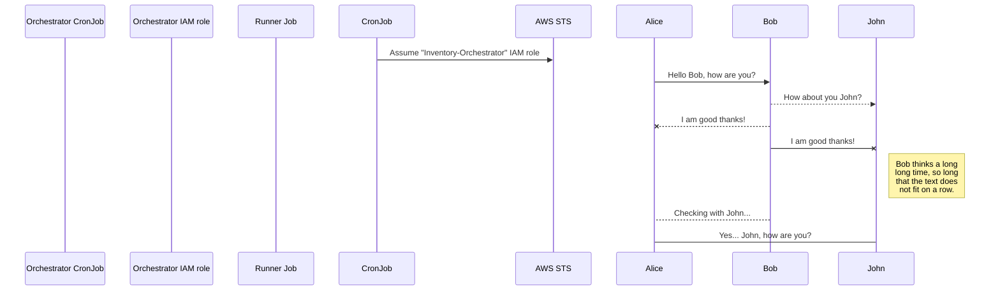
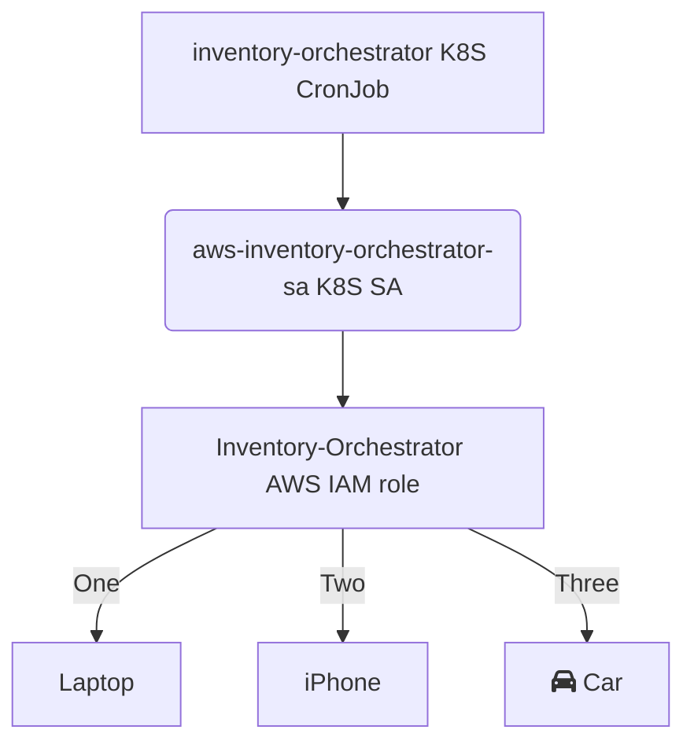

# AWS Inventory Orchestrator

## Sequence

Diagrams needed:

- Role/trust hierarchy [TD]
- CronJob job spawning and role assumption [sequence]





## Inventory IAM roles

The AWS inventory orchestration involves three IAM roles:

| Role name                | Account                           | Can be assumed by                  | Permission summary                           |
| ------------------------ | --------------------------------- | ---------------------------------- | -------------------------------------------- |
| `Inventory-Orchestrator` | *Billing* (aka. Master)           | *Orchestrator* k8s service account | Get all account ID's from AWS Organization   |
| `Inventory-Runner`       | *Security*                        | *Runner* k8s service account       | Upload inventory report to central S3 bucket |
| `inventory`              | All accounts where inventory runs | `Inventory-Runner` IAM role        | `Get*`/`List*`/`Describe*` everything        |

You can use the [ce-cli](https://github.com/dfds/ce-cli) tool to deploy the `inventory` IAM role into all AWS accounts in the AWS Organization.

Regardless of how the role is deployed, the following you need to apply the properties and policies to the role specified in the following files.

All of them reside under `/infrastructure/policies/`.

| File                        | Description                                                                          |
| --------------------------- | ------------------------------------------------------------------------------------ |
| `inventory_policy.json`     | The inline permission policy document to attach                                      |
| `inventory_properties.json` | Various properties for the role, including any managed permission policies to attach |
| `inventory_trust.json`      | The role trust policy document (substitute `{{.SecurityAccountId}}`)                 |

If using the `ce-cli` tool, these files need to be uploaded to the path described in the [Backend bucket structure](https://github.com/dfds/ce-cli#backend-bucket-structure) section.

## Development

*Work in progress.*

Create `./k8s/vars.env`:

```env
ORCHESTRATOR_ROLE_ARN=arn:aws:iam::$BILLING_ACCOUNT_ID:role/Inventory-Orchestrator
RUNNER_ROLE_ARN=arn:aws:iam::$SECURITY_ACCOUNT_ID:role/Inventory-Runner
CRON_SCHEDULE=* * * * 0
S3_BUCKET=inventory-output-goes-here
```

Run `skaffold dev`.

Trigger CronJob and tails logs:

```
kubectl -n inventory create job aws-inventory-orchestrator-manual --from=cronjob/aws-inventory-orchestrator

# tail logs command to be documented
```

```
aws_recon -v -r global,eu-west-1,eu-central-1 --s3-bucket raras-inventory:eu-west-1
aws_recon -v -r global,eu-west-1,eu-central-1 | grep "not authorized"
```

Example path (uploaded by Recon):

```
s3://${S3_BUCKET}/AWSRecon/${YEAR}/${MONTH}/${DAY}/${ACCOUNT_ID}_aws_recon_1649767394.json.gz
```
