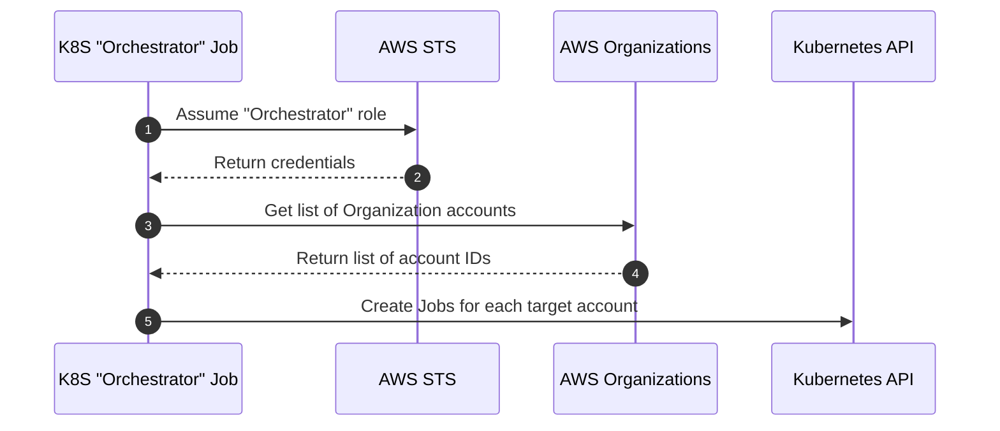
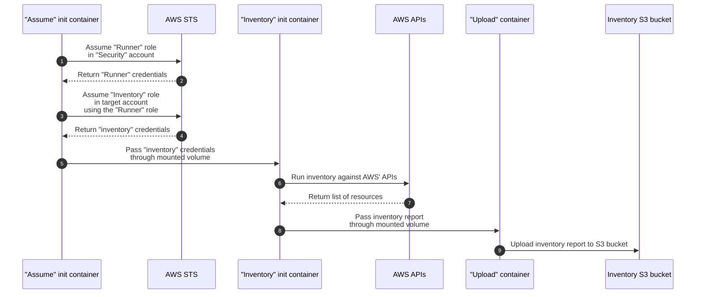
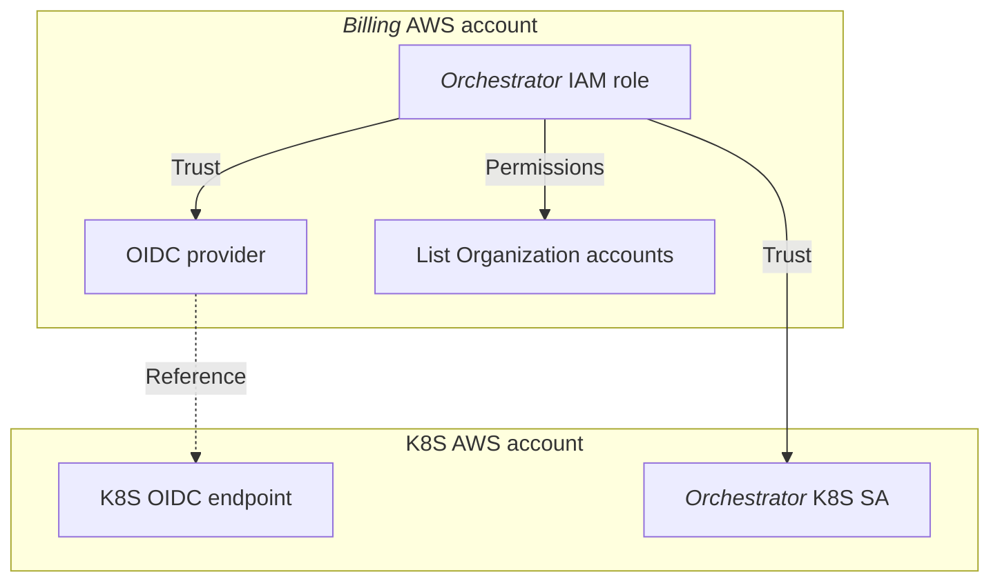
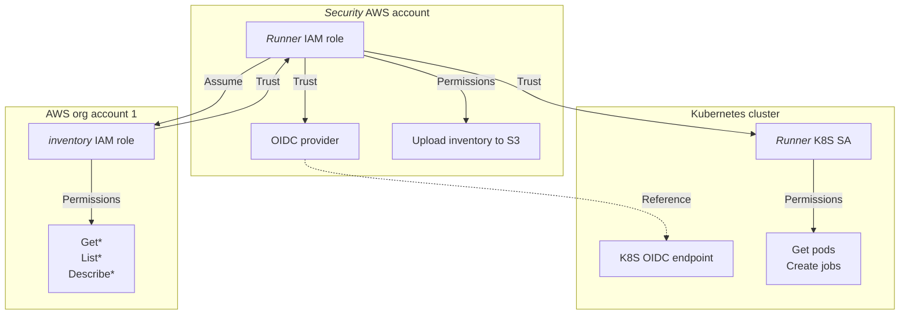

# AWS Inventory Orchestrator

## Deploying prerequisites

Most of the required IAM roles and S3 buckets are provisioned with the `infrastructure` tool.

Maybe this should have been Terraform'ed, but we didn't want to deal with state. Considering how the `infrastructure` tool has evolved, maybe we should have.

There's currently a hard dependency on the [`ce-cli`][ce-cli], which is used to deploy the `inventory` IAM role across all AWS accounts in the Organization.

Be sure to set the variables before running.

Example usage:

**Bash**

```bash
# Variables
BILLING_ACCOUNT_ID=""
SECURITY_ACCOUNT_ID=""
CLI_BUCKET_NAME=""
INVENTORY_BUCKET_NAME=""
OIDC_PROVIDER_PROD=""

# Defaults
BILLING_AWS_PROFILE="billing-admin"
SECURITY_AWS_PROFILE="security-admin"
INVENTORY_ROLE="inventory"
ORCHESTRATOR_ROLE_DEPLOY="Inventory-Orchestrator"
RUNNER_ROLE_DEPLOY="Inventory-Runner"

# Login with SAML to the Billing and Security account
saml2aws login --role arn:aws:iam::${BILLING_ACCOUNT_ID}:role/ADFS-Admin --profile ${BILLING_AWS_PROFILE} --skip-prompt
saml2aws login --role arn:aws:iam::${SECURITY_ACCOUNT_ID}:role/CloudAdmin --profile ${SECURITY_AWS_PROFILE} --skip-prompt

# Provision infrastructure
./infrastructure --billing-aws-profile "${BILLING_AWS_PROFILE}" --security-aws-profile "${SECURITY_AWS_PROFILE}" --cli-bucket-name "${CLI_BUCKET_NAME}" --inventory-bucket-name "${INVENTORY_BUCKET_NAME}" --inventory-role "${INVENTORY_ROLE}" --orchestrator-role "${ORCHESTRATOR_ROLE_DEPLOY}" --runner-role "${RUNNER_ROLE_DEPLOY}" --oidc-provider-prod "${OIDC_PROVIDER_PROD}"
```

**PowerShell**

```powershell
# Variables
$BILLING_ACCOUNT_ID=""
$SECURITY_ACCOUNT_ID=""
$CLI_BUCKET_NAME=""
$INVENTORY_BUCKET_NAME=""
$OIDC_PROVIDER_PROD=""

# Defaults
$BILLING_AWS_PROFILE="billing-admin"
$SECURITY_AWS_PROFILE="security-admin"
$INVENTORY_ROLE="inventory"
$ORCHESTRATOR_ROLE_DEPLOY="Inventory-Orchestrator"
$RUNNER_ROLE_DEPLOY="Inventory-Runner"

# Login with SAML to the Billing and Security account
saml2aws login --role arn:aws:iam::${BILLING_ACCOUNT_ID}:role/ADFS-Admin --profile ${BILLING_AWS_PROFILE} --skip-prompt
saml2aws login --role arn:aws:iam::${SECURITY_ACCOUNT_ID}:role/CloudAdmin --profile ${SECURITY_AWS_PROFILE} --skip-prompt

# Provision infrastructure
./infrastructure --billing-aws-profile "${BILLING_AWS_PROFILE}" --security-aws-profile "${SECURITY_AWS_PROFILE}" --cli-bucket-name "${CLI_BUCKET_NAME}" --inventory-bucket-name "${INVENTORY_BUCKET_NAME}" --inventory-role "${INVENTORY_ROLE}" --orchestrator-role "${ORCHESTRATOR_ROLE_DEPLOY}" --runner-role "${RUNNER_ROLE_DEPLOY}" --oidc-provider-prod "${OIDC_PROVIDER_PROD}"
```

Once infrastructure has been provisioned, deploy the `inventory` IAM role using the `ce-cli` tool, to all accounts to be inventoried.

Re-run the `infrastructure` tool at any time, if any of the policies, or any of the supplied input arguments, have changed.

## Sequence diagrams

### Orchestrator sequence

The "Orchestrator" Kubernetes *CronJob* spawns a new Kubernetes *Job* according to the defined schedule, or when triggered manually.



### Runner sequence



## Inventory IAM roles

The AWS inventory orchestration involves five different IAM roles:

| Role name                     | Account                           | Can be assumed by                                                  | Permission summary                           |
| ----------------------------- | --------------------------------- | ------------------------------------------------------------------ | -------------------------------------------- |
| `Inventory-Orchestrator`      | *Billing* (aka. Master)           | *Orchestrator* k8s service account<br>in *Prod* using OIDC         | Get all account ID's from AWS Organization   |
| `Inventory-Orchestrator-Test` | *Billing* (aka. Master)           | *Orchestrator* k8s service accounts<br>in test clusters using OIDC | Get all account ID's from AWS Organization   |
| `Inventory-Runner`            | *Security*                        | *Runner* k8s service account in *Prod*                             | Upload inventory report to central S3 bucket |
| `Inventory-Runner-Test`       | *Security*                        | *Runner* k8s service account in test clusters                      | Upload inventory report to central S3 bucket |
| `inventory`                   | All accounts where inventory runs | `Inventory-Runner` and<br>`Inventory-Runner-Test` IAM role         | `Get*`/`List*`/`Describe*` everything        |

We currently assume that the [`ce-cli`][ce-cli] tool is used to deploy the `inventory` IAM role into all AWS accounts in the AWS Organization. The `infrastructure` tool will upload the required files to the S3 bucket used by the `ce-cli` tool to their proper location.

The following files under `/infrastructure/policies/` are used to configure the `inventory` IAM role:

| File                        | Description                                                                          |
| --------------------------- | ------------------------------------------------------------------------------------ |
| `inventory_policy.json`     | The inline permission policy document to attach                                      |
| `inventory_properties.json` | Various properties for the role, including any managed permission policies to attach |
| `inventory_trust.json`      | The role trust policy document                                                       |

### Inventory-Orchestrator trust relationships



The only difference between the `Inventory-Orchestrator` and `Inventory-Orchestrator-Test` role, is the trusted OIDC providers. The non-`Test` role trust OIDC providers referencing OIDC endpoints of production Kubernetes clusters, whereas the `-Test` role trust OIDC providers for any test/sandbox clusters.

### Inventory-Runner trust relationship



The only difference between the `Inventory-Runner` and `Inventory-Runner-Test` role, is the trusted OIDC providers. The non-`Test` role trust OIDC providers referencing OIDC endpoints of production Kubernetes clusters, whereas the `-Test` role trust OIDC providers for any test/sandbox clusters.

## Development

*Work in progress.*

Deploy OIDC provider for your sandbox cluster in both Billing and Security account (use [`ce-cli`][ce-cli])

```bash
aws --include-account-ids "BillingAccountId,SecurityAccountId" create-oidc-provider --url "https://oidc.eks.eu-west-1.amazonaws.com/id/SOMETHING" --cluster-name "Rasmus-Sandbox"
```

Set env vars

Create `./k8s/vars.env`:

```env
ORCHESTRATOR_ROLE_ARN=arn:aws:iam::$BILLING_ACCOUNT_ID:role/Inventory-Orchestrator
RUNNER_ROLE_ARN=arn:aws:iam::$SECURITY_ACCOUNT_ID:role/Inventory-Runner
CRON_SCHEDULE=* * * * 0
S3_BUCKET=inventory-output-goes-here
```

Run `skaffold dev`.

Trigger CronJob and tails logs:

```
kubectl -n inventory create job aws-inventory-orchestrator-manual --from=cronjob/aws-inventory-orchestrator

# tail logs command to be documented
```

```
aws_recon -v -r global,eu-west-1,eu-central-1 --s3-bucket raras-inventory:eu-west-1
aws_recon -v -r global,eu-west-1,eu-central-1 | grep "not authorized"
```

Example path (uploaded by Recon):

```
s3://${S3_BUCKET}/AWSRecon/${YEAR}/${MONTH}/${DAY}/${ACCOUNT_ID}_aws_recon_1649767394.json.gz
```

---
[ce-cli]: <https://github.com/dfds/ce-cli>